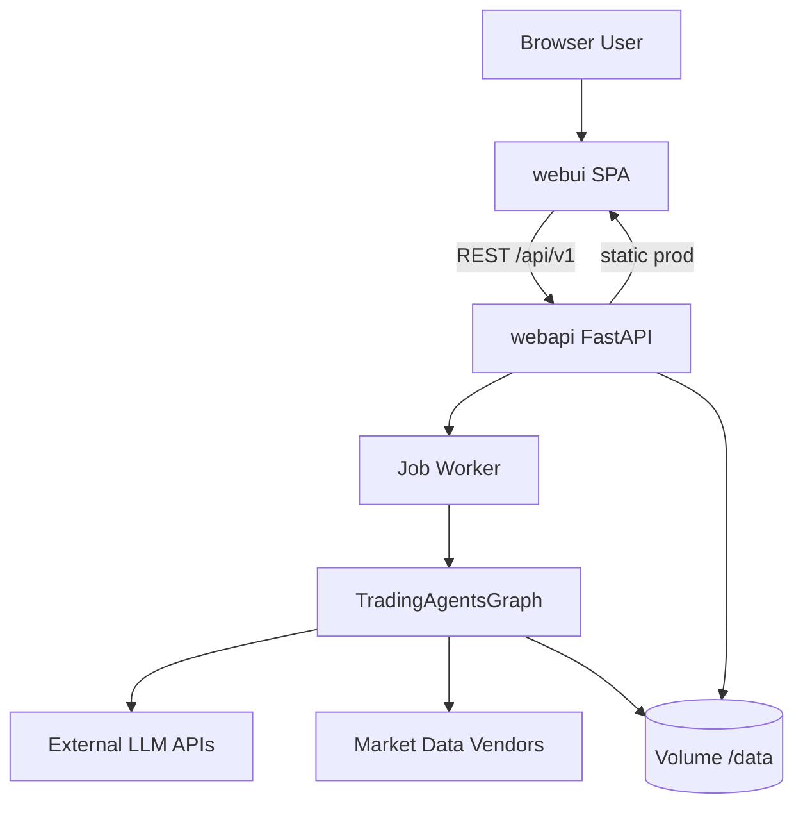

# ARCH：TradingAgents Web 平台技术架构

| 字段 | 值 |
|------|-----|
| 版本 | 0.1.0-draft |
| 状态 | 待开发 |
| 默认 LLM | **小米 MiMo（mimo）** — 见 §4.0 |
| 关联 | [PRD-web-platform.md](./PRD-web-platform.md)、[TEST-automation-web-platform.md](./TEST-automation-web-platform.md) |

---

## 1. 架构原则

1. **复用核心，薄 Web 层**：不重写 Agent 逻辑；Web 只包装 `TradingAgentsGraph`。
2. **本地 Docker 先行**：单 `docker-compose.web.yml` 可演示全功能。
3. **AI 可机械执行**：目录、接口、文件名固定；Task 粒度 ≤ 1 天。
4. **测试友好**：API 可 mock Graph；E2E 可 `TRADINGAGENTS_MOCK_GRAPH=1` 跳真实 LLM。
5. **默认 mimo**：本地 Docker 与联调默认走 **小米 MiMo** API，CI 仍 mock。

---

## 4.0 默认 LLM 配置（小米 MiMo / mimo）

> **mimo** = **小米 MiMo 大模型 API**（[mimo.mi.com](https://mimo.mi.com)）。**不是 MiniMax。**

MiMo 提供 OpenAI 兼容协议；TradingAgents 通过 `openai_compatible` provider 接入。

### 4.0.1 默认环境变量

实施时在 `webapi/config.py`、`docker-compose.web.yml` 与 `docs/env/web.defaults.env` 保持一致：

```bash
# --- 小米 MiMo（mimo）默认 ---
TRADINGAGENTS_LLM_PROVIDER=openai_compatible
TRADINGAGENTS_DEEP_THINK_LLM=mimo-v2.5-pro
TRADINGAGENTS_QUICK_THINK_LLM=mimo-v2.5-pro
TRADINGAGENTS_LLM_BACKEND_URL=https://api.xiaomimimo.com/v1
TRADINGAGENTS_OUTPUT_LANGUAGE=Chinese

# 小米官方 Key 名（sk- 按量 / tp- Token Plan）
MIMO_API_KEY=
# webapi 启动时同步到 TradingAgents 所需变量：
OPENAI_COMPATIBLE_API_KEY=

# Token Plan 中国区用户改用：
# TRADINGAGENTS_LLM_BACKEND_URL=https://token-plan-cn.xiaomimimo.com/v1

# CI / 无 Key 冒烟
# TRADINGAGENTS_MOCK_GRAPH=1
```

### 4.0.2 webapi 配置加载顺序

```
1. tradingagents.DEFAULT_CONFIG（上游默认，CLI 仍为 openai）
2. webapi 启动：MIMO_API_KEY → OPENAI_COMPATIBLE_API_KEY（若后者空）
3. TRADINGAGENTS_* 环境变量（已有 _apply_env_overrides）
4. webapi/config.py WebSettings 默认值（未设 env 时落 mimo）
5. TRADINGAGENTS_MOCK_GRAPH=1 时跳过 Key 校验、不调 LLM
```

### 4.0.3 graph_runner 构建 config 示例

```python
from tradingagents.default_config import DEFAULT_CONFIG
import os

def build_graph_config(data_dir: Path) -> dict:
    if os.getenv("MIMO_API_KEY") and not os.getenv("OPENAI_COMPATIBLE_API_KEY"):
        os.environ["OPENAI_COMPATIBLE_API_KEY"] = os.environ["MIMO_API_KEY"]
    cfg = dict(DEFAULT_CONFIG)
    cfg["results_dir"] = str(data_dir / "reports")
    cfg["data_cache_dir"] = str(data_dir / "cache")
    return cfg
```

### 4.0.4 `/ready` 与 mimo

| 模式 | `/ready` 条件 |
|------|----------------|
| 正常 | `MIMO_API_KEY` 或 `OPENAI_COMPATIBLE_API_KEY` 非空 + `DATA_DIR` 可写 |
| `TRADINGAGENTS_MOCK_GRAPH=1` | 仅检查 `DATA_DIR` 可写 |

### 4.0.5 MiMo 认证头（实施注意）

[MiMo OpenAI API 文档](https://mimo.mi.com/docs/zh-CN/api/chat/openai-api) 支持：

- `api-key: $MIMO_API_KEY`
- `Authorization: Bearer $MIMO_API_KEY`

LangChain `ChatOpenAI` 默认 Bearer。若联调 401，在 `webapi/services/graph_runner.py` 或自定义 client 中额外注入 `api-key` 头，或确认 `OPENAI_COMPATIBLE_API_KEY` 已正确传入。

---

## 2. 系统上下文



**Phase 2（懒猫）**：同一 `web` 镜像，LPK `routes` 指向 `8080`，持久化挂载 `/lzcapp/var` → `/data`。

---

## 3. 仓库目录结构（目标态）

```text
TradingAgents/
├── tradingagents/          # 现有核心包（不破坏）
├── cli/                    # 现有 CLI（不破坏）
├── webapi/                 # 【新增】FastAPI 后端
│   ├── __init__.py
│   ├── main.py             # app 工厂、路由挂载、静态文件
│   ├── config.py           # Web 专用 settings
│   ├── dependencies.py
│   ├── models/
│   │   ├── job.py          # Job ORM / Pydantic
│   │   └── schemas.py      # API request/response
│   ├── routes/
│   │   ├── health.py
│   │   ├── config.py
│   │   └── runs.py
│   ├── services/
│   │   ├── job_store.py    # SQLite CRUD
│   │   ├── job_runner.py   # 队列 + worker 线程
│   │   └── graph_runner.py # 封装 propagate + save_reports
│   └── static/             # prod: vite build 输出复制到此
├── webui/                  # 【新增】前端 SPA
│   ├── package.json
│   ├── vite.config.ts
│   ├── playwright.config.ts
│   ├── src/
│   │   ├── main.tsx
│   │   ├── api/client.ts
│   │   ├── pages/
│   │   │   ├── Home.tsx
│   │   │   ├── RunList.tsx
│   │   │   └── RunDetail.tsx
│   │   └── components/
│   └── e2e/
├── tests/
│   ├── webapi/             # 【新增】API 单测/集成
│   └── integration/web/    # 【新增】全栈集成（TestClient + mock graph）
├── docker/
│   ├── Dockerfile.web      # 【新增】Web 全栈镜像
│   └── nginx.conf          # 可选：dev 分离时使用
├── docker-compose.web.yml  # 【新增】本地 Web 编排
├── scripts/
│   ├── dev-web.sh          # 本地非 Docker 开发
│   └── test-web.sh         # 一键跑 Web 测试套件
└── docs/
    ├── PRD-web-platform.md
    ├── ARCH-web-platform.md
    ├── TEST-automation-web-platform.md
    └── env/
        └── web.defaults.env   # mimo 默认 env 模板
```

---

## 4. 后端设计（webapi）

### 4.1 技术栈

| 组件 | 选型 | 理由 |
|------|------|------|
| 框架 | FastAPI | 与 Python 栈一致，OpenAPI 自动生成 |
| ASGI | uvicorn | 轻量，Docker 友好 |
| 校验 | Pydantic v2 | FastAPI 默认 |
| Job 存储 | SQLite + aiosqlite 或 sync sqlite3 | 无 Redis 依赖 |
| 任务执行 | `threading` + `queue.Queue` | Graph 同步阻塞；单 worker 线程 |
| 静态资源 | FastAPI `StaticFiles` | 生产单容器托管 SPA |

**pyproject.toml 新增 optional extra**：

```toml
[project.optional-dependencies]
web = [
    "fastapi>=0.115",
    "uvicorn[standard]>=0.32",
    "python-multipart>=0.0.9",
    "httpx>=0.27",
]
```

### 4.2 API 契约

#### POST `/api/v1/runs`

Request:

```json
{
  "ticker": "AAPL",
  "trade_date": "2026-07-02",
  "asset_type": "stock",
  "analysts": ["market", "news"],
  "research_depth": {
    "max_debate_rounds": 1,
    "max_risk_rounds": 1
  }
}
```

Response `201`:

```json
{
  "job_id": "550e8400-e29b-41d4-a716-446655440000",
  "status": "queued",
  "created_at": "2026-07-02T12:00:00Z"
}
```

#### GET `/api/v1/runs/{job_id}`

```json
{
  "job_id": "...",
  "status": "running",
  "progress": {
    "stage": "analysts",
    "message": "Market Analyst",
    "percent": 25
  },
  "ticker": "AAPL",
  "trade_date": "2026-07-02",
  "report_ready": false,
  "error": null,
  "created_at": "...",
  "updated_at": "..."
}
```

#### GET `/api/v1/runs/{job_id}/report`

- `200`：`text/markdown; charset=utf-8` 正文
- `404`：job 未完成或报告不存在

### 4.3 Graph 封装（graph_runner.py）

```python
# 伪代码 — AI 实施时照此实现
def run_analysis_job(job: Job, config: dict) -> Path:
    graph = TradingAgentsGraph(
        selected_analysts=job.analysts,
        config=config,
        callbacks=[ProgressCallback(job.id)],  # 写 job_store
    )
    final_state, _ = graph.propagate(job.ticker, job.trade_date, job.asset_type)
    return graph.save_reports(final_state, job.ticker, save_path=job.report_dir)
```

**Config 构建**：从 `DEFAULT_CONFIG` 出发，合并 `TRADINGAGENTS_*` env（已有 `_apply_env_overrides`），Web 层只覆盖：

- `results_dir` → `{DATA_DIR}/reports`
- `data_cache_dir` → `{DATA_DIR}/cache`

### 4.4 Job 表（SQLite）

```sql
CREATE TABLE jobs (
  id TEXT PRIMARY KEY,
  status TEXT NOT NULL,
  ticker TEXT NOT NULL,
  trade_date TEXT NOT NULL,
  asset_type TEXT NOT NULL,
  analysts_json TEXT NOT NULL,
  progress_json TEXT,
  error TEXT,
  report_dir TEXT,
  created_at TEXT NOT NULL,
  updated_at TEXT NOT NULL
);
```

### 4.5 健康检查

| 端点 | 逻辑 |
|------|------|
| `/health` | 进程存活即 200 |
| `/ready` | `DATA_DIR` 可写 + `ensure_api_key()` 逻辑通过（复用 `cli.utils.ensure_api_key` 的 provider 检测，**不交互**） |

### 4.6 Mock 模式（测试 / 本地无 Key）

环境变量 `TRADINGAGENTS_MOCK_GRAPH=1`：

- `graph_runner` 不调用真实 LLM，写入 fixture `tests/fixtures/mock_complete_report.md` 到 job 目录。
- `/ready` 在 mock 模式下跳过 Key 检查。

---

## 5. 前端设计（webui）

### 5.1 技术栈

| 组件 | 选型 |
|------|------|
| 构建 | Vite 6 |
| UI | React 19 + TypeScript |
| 路由 | react-router-dom |
| 请求 | fetch 封装 / 可选 tanstack-query |
| Markdown | react-markdown + remark-gfm |
| 样式 | Tailwind CSS 4 或现有极简 CSS（AI 择一，保持轻量） |
| E2E | Playwright |

### 5.2 开发 vs 生产

| 模式 | 前端 | API |
|------|------|-----|
| Dev | `npm run dev` → `:5173`，Vite proxy `/api` → `:8080` | `uvicorn webapi.main:app --reload` |
| Docker prod | `npm run build` → 复制到 `webapi/static/` | 同容器 uvicorn 托管 API + static |

### 5.3 关键交互

1. **Home**：表单 → `POST /runs` → 跳转 `/runs/:id`
2. **RunDetail**：`setInterval(3000)` 调 `GET /runs/:id` 直到终态
3. **Report**：终态后 `GET /runs/:id/report` 渲染 Markdown

---

## 6. Docker 架构

### 6.1 Dockerfile.web（多阶段）

```dockerfile
# stage: frontend-build — node:22-alpine, npm ci && npm run build
# stage: python-build   — 沿用现有 builder 装 .[web]
# stage: runtime          — python:3.12-slim, COPY webapi + static + venv
# USER appuser
# ENV TRADINGAGENTS_DATA_DIR=/data
# VOLUME /data
# EXPOSE 8080
# CMD ["uvicorn", "webapi.main:app", "--host", "0.0.0.0", "--port", "8080"]
```

### 6.2 docker-compose.web.yml

```yaml
services:
  web:
    build:
      context: .
      dockerfile: docker/Dockerfile.web
    ports:
      - "8080:8080"
    env_file:
      - .env
    environment:
      - TRADINGAGENTS_DATA_DIR=/data
      - TRADINGAGENTS_MOCK_GRAPH=${TRADINGAGENTS_MOCK_GRAPH:-0}
      # 小米 MiMo（mimo）默认（可被 .env 覆盖）
      - TRADINGAGENTS_LLM_PROVIDER=${TRADINGAGENTS_LLM_PROVIDER:-openai_compatible}
      - TRADINGAGENTS_DEEP_THINK_LLM=${TRADINGAGENTS_DEEP_THINK_LLM:-mimo-v2.5-pro}
      - TRADINGAGENTS_QUICK_THINK_LLM=${TRADINGAGENTS_QUICK_THINK_LLM:-mimo-v2.5-pro}
      - TRADINGAGENTS_LLM_BACKEND_URL=${TRADINGAGENTS_LLM_BACKEND_URL:-https://api.xiaomimimo.com/v1}
      - TRADINGAGENTS_OUTPUT_LANGUAGE=${TRADINGAGENTS_OUTPUT_LANGUAGE:-Chinese}
    volumes:
      - tradingagents_web_data:/data
    healthcheck:
      test: ["CMD", "curl", "-f", "http://localhost:8080/health"]
      interval: 30s
      timeout: 5s
      retries: 3

volumes:
  tradingagents_web_data:
```

### 6.3 本地启动命令（验收用）

```bash
cp docs/env/web.defaults.env .env
# 编辑 .env，填入 MIMO_API_KEY

# 无 Key 快速演示（CI 同款，不调 mimo）：
TRADINGAGENTS_MOCK_GRAPH=1 docker compose -f docker-compose.web.yml up --build

# 真实 mimo 联调：
docker compose -f docker-compose.web.yml up --build
# 浏览器 http://localhost:8080
# 确认 /api/v1/config/public → llm_provider=openai_compatible, deep_think_llm=mimo-v2.5-pro
```

---

## 7. 与现有 CLI 的关系

| 入口 | 说明 |
|------|------|
| `tradingagents` CLI | 不变；独立 entrypoint |
| `webapi` | 新 entrypoint：`uvicorn webapi.main:app` |
| 共享 | `tradingagents.*`、`write_report_tree`、`DEFAULT_CONFIG` |

**禁止**：在 `cli/main.py` 内嵌 FastAPI；Web 为独立包 `webapi/`。

---

## 8. Phase 2：懒猫 LPK 映射（预留）

| 概念 | 映射 |
|------|------|
| 服务 | 单 service `web`，container port 8080 |
| 路由 | `/` → web:8080 |
| 持久化 | `/lzcapp/var` → `/data` |
| 环境 | `lzc-deploy-params.yml` 映射 `MIMO_API_KEY` + mimo 模型 env |
| 健康检查 | `curl -f http://127.0.0.1:8080/ready` |
| public_path | Phase 2 再定（默认全站需登录） |

文件占位（M6 再创建）：

- `package.yml`
- `lzc-manifest.yml`
- `lzc-build.yml`

---

## 9. AI 实施 Task 拆分

| Task | 文件 | 依赖 |
|------|------|------|
| T1 | `webapi/config.py`, `webapi/main.py`, `routes/health.py` | — |
| T2 | `webapi/models/*`, `services/job_store.py` | T1 |
| T3 | `services/graph_runner.py`, `job_runner.py`, `routes/runs.py` | T2 |
| T4 | `tests/webapi/*` | T3 |
| T5 | `webui/` 脚手架 + pages | T3 |
| T6 | `docker/Dockerfile.web`, `docker-compose.web.yml` | T5 |
| T7 | `scripts/test-web.sh`, CI job | T6 |
| T8 | `webui/e2e/*`, Playwright | T6 |

每个 Task 完成时运行 TEST 文档对应章节。

---

## 10. 安全要点

- `.env` 仅 Docker `env_file` 注入，不进镜像层。
- `GET /runs/{id}/artifacts/{path}`：只允许 `report_dir` 下相对路径，拒绝 `..`。
- CORS：生产默认同源（静态与 API 同域）；dev 允许 `5173`。
- 日志：禁止打印 `*_API_KEY`。

---

## 11. 观测与日志

```python
logger.info("job_started", extra={"job_id": job.id, "ticker": job.ticker})
logger.info("job_finished", extra={"job_id": job.id, "status": "succeeded", "report_dir": str(path)})
```

可选：OpenAPI `/docs` 仅 `TRADINGAGENTS_OPENAPI=1` 时开启。
