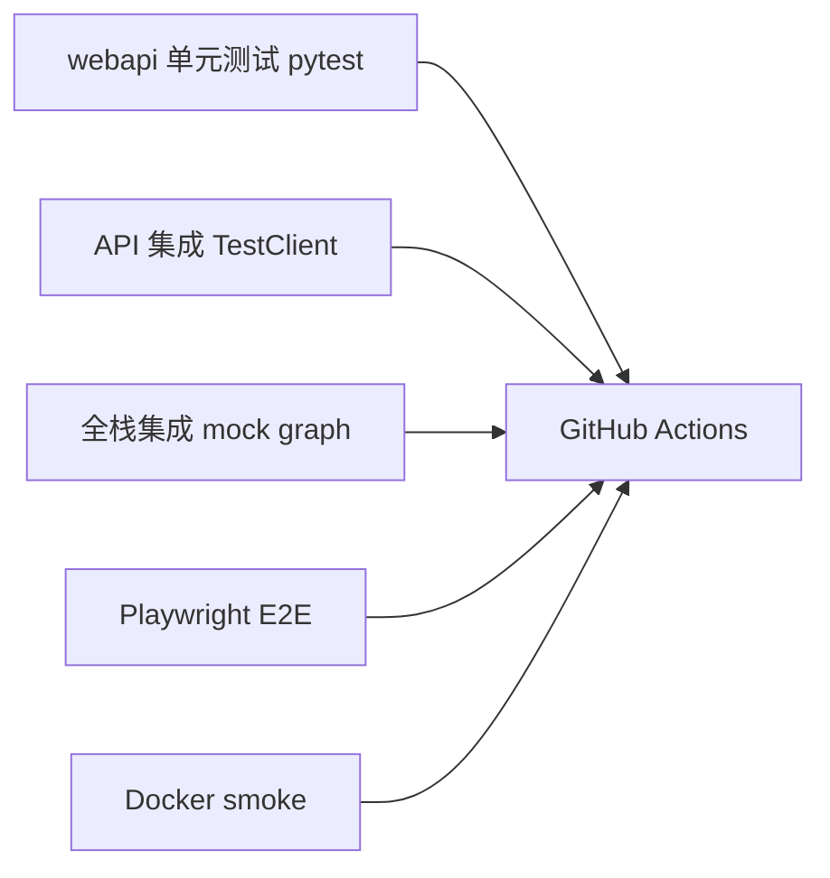

# TEST：Web 平台自动化测试方案

| 字段 | 值 |
|------|-----|
| 版本 | 0.1.0-draft |
| 状态 | 待开发 |
| 默认 LLM | **小米 MiMo（mimo）** — CI 仍 mock；见 §2、§10 |
| 关联 | [PRD-web-platform.md](./PRD-web-platform.md)、[ARCH-web-platform.md](./ARCH-web-platform.md) |

---

## 1. 测试策略总览



| 层级 | 工具 | 运行时机 | 是否调真实 LLM |
|------|------|----------|----------------|
| L1 单元 | pytest | 每次 commit | 否 |
| L2 API | httpx + FastAPI TestClient | 每次 commit | 否 |
| L3 集成 | pytest + mock graph | 每次 commit | 否 |
| L4 E2E | Playwright | PR / nightly | 否（mock） |
| L5 Docker smoke | shell + curl | PR | 否（mock） |
| L6 真实 LLM 冒烟（mimo） | 手动 / nightly optional | 可选 | 是（小米 MiMo） |

**原则**：CI 默认 **零 API Key、零 LLM 费用**（`TRADINGAGENTS_MOCK_GRAPH=1`）；**本地 Docker 联调默认 mimo**（见 `docs/env/web.defaults.env`）。

---

## 2. 环境变量（测试专用）

| 变量 | 值 | 用途 |
|------|-----|------|
| `TRADINGAGENTS_MOCK_GRAPH` | `1` | Graph 写 fixture 报告；**CI 必开** |
| `TRADINGAGENTS_DATA_DIR` | tmp_path / `/tmp/ta-test` | 隔离数据 |
| `TRADINGAGENTS_JOB_CONCURRENCY` | `1` | 确定性 |
| `CI` | `true` | 缩短 Playwright timeout |

### 2.1 mimo 本地联调（非 CI）

复制 `docs/env/web.defaults.env` → `.env`，设置：

| 变量 | 值 |
|------|-----|
| `MIMO_API_KEY` | 小米 MiMo 控制台 Key（`sk-` 或 `tp-`） |
| `TRADINGAGENTS_LLM_PROVIDER` | `openai_compatible` |
| `TRADINGAGENTS_DEEP_THINK_LLM` | `mimo-v2.5-pro` |
| `TRADINGAGENTS_QUICK_THINK_LLM` | `mimo-v2.5-pro` |
| `TRADINGAGENTS_LLM_BACKEND_URL` | `https://api.xiaomimimo.com/v1` |
| `TRADINGAGENTS_MOCK_GRAPH` | `0`（或不设） |

**手动 mimo 冒烟命令**

```bash
cp docs/env/web.defaults.env .env
# 填入 MIMO_API_KEY
docker compose -f docker-compose.web.yml up --build -d
./scripts/test-web.sh mimo-smoke   # 实施时添加：真实 LLM 单 analyst 短跑
```

---

## 3. 里程碑门禁（与 PRD M1–M5 对齐）

### 3.1 M1 门禁 — API 骨架

**命令**

```bash
pytest tests/webapi/test_health.py -q
```

**必须通过的用例**

| 用例 ID | 断言 |
|---------|------|
| H-01 | `GET /health` → 200, `status==ok` |
| H-02 | `GET /ready` mock 模式 → 200 |
| H-03 | `GET /api/v1/config/public` 响应无 `*key*` 字段 |
| H-04 | 非 mock 且 env 默认时 `llm_provider==openai_compatible`，`deep_think_llm==mimo-v2.5-pro`，`llm_label` 含 `MiMo` |

### 3.2 M2 门禁 — Job 生命周期

**命令**

```bash
pytest tests/webapi/test_runs.py tests/integration/web/test_job_lifecycle.py -q
```

**必须通过的用例**

| 用例 ID | 断言 |
|---------|------|
| R-01 | `POST /runs` 非法 ticker → 422 |
| R-02 | `POST /runs` 合法 body → 201 + `job_id` |
| R-03 | mock graph 后 job → `succeeded`，磁盘有 `complete_report.md` |
| R-04 | `GET /runs/{id}/report` succeeded → 200 markdown |
| R-05 | running 时 report → 409 或 404（文档化一种） |
| R-06 | 并发 2 job，concurrency=1 → 第二个 queued 后顺序完成 |

### 3.3 M3 门禁 — 前端单测

**命令**

```bash
cd webui && npm ci && npm run test:unit
```

**必须覆盖**

| 用例 ID | 组件 | 断言 |
|---------|------|------|
| U-01 | `api/client.ts` | mock fetch 解析 job 状态 |
| U-02 | `RunDetail` | running 显示 spinner |
| U-03 | `ReportView` | 渲染 fixture markdown |

**工具**：Vitest + @testing-library/react

### 3.4 M4 门禁 — Docker 本地 smoke

**命令**

```bash
./scripts/test-web.sh docker-smoke
# 或 Windows:
# powershell -File scripts/test-web.ps1 docker-smoke
```

**脚本逻辑**

1. `TRADINGAGENTS_MOCK_GRAPH=1 docker compose -f docker-compose.web.yml up --build -d`
2. 等待 `curl -sf http://localhost:8080/health`
3. `curl -sf http://localhost:8080/ready`
4. `curl -sf -X POST http://localhost:8080/api/v1/runs -H 'Content-Type: application/json' -d '{"ticker":"AAPL","trade_date":"2026-07-02","asset_type":"stock","analysts":["market"]}'`
5. 轮询 job 最多 60s → `succeeded`
6. `curl -sf http://localhost:8080/api/v1/runs/{id}/report | head`
7. `docker compose -f docker-compose.web.yml down -v`
8. exit 0

### 3.5 M5 门禁 — CI 全绿

见 §6 `.github/workflows/web-ci.yml` 新增 job。

---

## 4. 目录与文件清单（测试资产）

```text
tests/
├── webapi/
│   ├── conftest.py           # TestClient, tmp DATA_DIR, mock env
│   ├── test_health.py
│   ├── test_config_public.py
│   └── test_runs.py
├── integration/web/
│   ├── conftest.py
│   └── test_job_lifecycle.py
└── fixtures/
    ├── mock_complete_report.md
    └── mock_graph_state.json

webui/
├── vitest.config.ts
├── playwright.config.ts
├── src/**/*.test.tsx
└── e2e/
    ├── smoke.spec.ts
    └── fixtures.ts

scripts/
├── test-web.sh               # 统一入口
└── test-web.ps1              # Windows 等价

.github/workflows/
└── web-ci.yml                # 新增
```

---

## 5. pytest 夹具设计

### 5.1 `tests/webapi/conftest.py`

```python
import os
import pytest
from fastapi.testclient import TestClient

@pytest.fixture(autouse=True)
def _web_test_env(tmp_path, monkeypatch):
    monkeypatch.setenv("TRADINGAGENTS_MOCK_GRAPH", "1")
    monkeypatch.setenv("TRADINGAGENTS_DATA_DIR", str(tmp_path))
    monkeypatch.delenv("OPENAI_API_KEY", raising=False)

@pytest.fixture
def client():
    from webapi.main import create_app
    with TestClient(create_app()) as c:
        yield c
```

### 5.2 Mock Graph 注入

在 `webapi/services/graph_runner.py` 支持：

```python
if os.getenv("TRADINGAGENTS_MOCK_GRAPH") == "1":
    return _mock_run(job)  # 复制 fixtures，sleep 0.5s 模拟进度
```

**测试可断言**：progress 字段从 `queued` → `running` → `succeeded`。

---

## 6. CI 配置（web-ci.yml 草案）

```yaml
name: Web CI

on:
  push:
    branches: [main]
    paths:
      - 'webapi/**'
      - 'webui/**'
      - 'docker/**'
      - 'docker-compose.web.yml'
      - 'tests/webapi/**'
      - 'tests/integration/web/**'
      - 'scripts/test-web.*'
  pull_request:
    paths:
      - 'webapi/**'
      - 'webui/**'
      - 'docker/**'
      - 'docker-compose.web.yml'
      - 'tests/webapi/**'
      - 'tests/integration/web/**'

jobs:
  web-api:
    runs-on: ubuntu-latest
    steps:
      - uses: actions/checkout@v4
      - uses: actions/setup-python@v5
        with:
          python-version: "3.12"
      - run: pip install -e ".[dev,web]"
      - run: pytest tests/webapi tests/integration/web -q

  web-ui-unit:
    runs-on: ubuntu-latest
    defaults:
      run:
        working-directory: webui
    steps:
      - uses: actions/checkout@v4
      - uses: actions/setup-node@v4
        with:
          node-version: "22"
          cache: npm
          cache-dependency-path: webui/package-lock.json
      - run: npm ci
      - run: npm run test:unit

  web-e2e:
    runs-on: ubuntu-latest
    steps:
      - uses: actions/checkout@v4
      - uses: actions/setup-python@v5
        with:
          python-version: "3.12"
      - uses: actions/setup-node@v4
        with:
          node-version: "22"
          cache: npm
          cache-dependency-path: webui/package-lock.json
      - run: pip install -e ".[dev,web]"
      - run: |
          export TRADINGAGENTS_MOCK_GRAPH=1
          uvicorn webapi.main:app --host 127.0.0.1 --port 8080 &
          sleep 2
      - working-directory: webui
        run: |
          npm ci
          npx playwright install --with-deps chromium
          npm run test:e2e

  web-docker-smoke:
    runs-on: ubuntu-latest
    steps:
      - uses: actions/checkout@v4
      - run: chmod +x scripts/test-web.sh
      - run: TRADINGAGENTS_MOCK_GRAPH=1 ./scripts/test-web.sh docker-smoke
```

---

## 7. Playwright E2E 场景

### 7.1 `webui/e2e/smoke.spec.ts`

| 步骤 | 操作 | 期望 |
|------|------|------|
| 1 | 访问 `/` | 标题含 TradingAgents |
| 2 | 填 ticker `AAPL`，日期，提交 | 跳转 `/runs/:id` |
| 3 | 等待 | 出现 `Succeeded` 或中文「完成」 |
| 4 | 点击「查看报告」 | 页面含 `Trading Analysis Report` |
| 5 | 截图 | 附加到 CI artifact（失败时） |

**baseURL**：`http://127.0.0.1:8080`（Docker smoke 用 `http://localhost:8080`）

### 7.2 Playwright 配置要点

```typescript
// playwright.config.ts
export default defineConfig({
  testDir: './e2e',
  timeout: 90_000,
  use: {
    baseURL: process.env.PLAYWRIGHT_BASE_URL ?? 'http://127.0.0.1:8080',
    trace: 'on-first-retry',
  },
  webServer: process.env.CI ? undefined : {
    command: 'npm run dev',
    port: 5173,
    reuseExistingServer: true,
  },
});
```

---

## 8. 统一测试入口脚本

### 8.1 `scripts/test-web.sh`

```bash
#!/usr/bin/env bash
set -euo pipefail
ROOT="$(cd "$(dirname "$0")/.." && pwd)"
cd "$ROOT"

export TRADINGAGENTS_MOCK_GRAPH="${TRADINGAGENTS_MOCK_GRAPH:-1}"

cmd="${1:-all}"

case "$cmd" in
  api)
    pytest tests/webapi tests/integration/web -q
    ;;
  ui-unit)
    (cd webui && npm ci && npm run test:unit)
    ;;
  e2e)
    uvicorn webapi.main:app --host 127.0.0.1 --port 8080 &
    PID=$!
    trap "kill $PID" EXIT
    sleep 2
    (cd webui && npm ci && npx playwright install chromium && npm run test:e2e)
    ;;
  docker-smoke)
    TRADINGAGENTS_MOCK_GRAPH=1 docker compose -f docker-compose.web.yml up --build -d
    trap "docker compose -f docker-compose.web.yml down -v" EXIT
    for i in $(seq 1 30); do curl -sf http://localhost:8080/health && break; sleep 2; done
    curl -sf http://localhost:8080/ready
    JOB=$(curl -sf -X POST http://localhost:8080/api/v1/runs \
      -H 'Content-Type: application/json' \
      -d '{"ticker":"AAPL","trade_date":"2026-07-02","asset_type":"stock","analysts":["market"]}')
    ID=$(echo "$JOB" | python -c "import sys,json; print(json.load(sys.stdin)['job_id'])")
    for i in $(seq 1 30); do
      ST=$(curl -sf "http://localhost:8080/api/v1/runs/$ID" | python -c "import sys,json; print(json.load(sys.stdin)['status'])")
      [ "$ST" = "succeeded" ] && break
      sleep 2
    done
    [ "$ST" = "succeeded" ]
    curl -sf "http://localhost:8080/api/v1/runs/$ID/report" | grep -q "Trading Analysis Report"
    ;;
  all)
    "$0" api
    "$0" ui-unit
    "$0" e2e
    ;;
  *)
    echo "Usage: $0 {api|ui-unit|e2e|docker-smoke|all}" >&2
    exit 1
    ;;
esac
```

### 8.2 Windows `scripts/test-web.ps1`

提供与 `.sh` 等价的 `api`、`docker-smoke` 子命令（AI 实施时编写）。

---

## 9. 回归：原有测试不受影响

每次 Web PR 必须仍通过：

```bash
pytest -q                    # 原 50+ 测试
ruff check .
```

Web 测试 **追加**，不替换 `tests/test_*.py`。

---

## 10. 可选：真实 LLM 夜间任务（mimo）

| 项 | 说明 |
|----|------|
| 触发 | `schedule: cron` weekly 或 manual `workflow_dispatch` |
| 密钥 | GitHub Secrets **`MIMO_API_KEY`** |
| Provider | `openai_compatible` + MiMo Base URL |
| 模型 | `mimo-v2.5-pro` |
| 范围 | 单 analyst `["market"]`，ticker `600519.SS` 或 `AAPL` |
| 断言 | job succeeded + report 长度 > 500 字符 + 含中文或 `Trading Analysis Report` |
| 失败 | 通知即可，不 block main |

### 10.1 `mimo-smoke` 脚本（本地，实施时写入 `scripts/test-web.sh`）

```bash
mimo-smoke)
  # 要求 .env 中 MIMO_API_KEY 已配置，且 TRADINGAGENTS_MOCK_GRAPH 未启用
  docker compose -f docker-compose.web.yml up --build -d
  trap "docker compose -f docker-compose.web.yml down" EXIT
  curl -sf http://localhost:8080/ready
  curl -sf http://localhost:8080/api/v1/config/public | grep -q mimo-v2.5-pro
  JOB=$(curl -sf -X POST http://localhost:8080/api/v1/runs \
    -H 'Content-Type: application/json' \
    -d '{"ticker":"600519.SS","trade_date":"2026-07-02","asset_type":"stock","analysts":["market"]}')
  ID=$(echo "$JOB" | python -c "import sys,json; print(json.load(sys.stdin)['job_id'])")
  for i in $(seq 1 120); do
    ST=$(curl -sf "http://localhost:8080/api/v1/runs/$ID" | python -c "import sys,json; print(json.load(sys.stdin)['status'])")
    [ "$ST" = "succeeded" ] && break
    [ "$ST" = "failed" ] && exit 1
    sleep 5
  done
  [ "$ST" = "succeeded" ]
  curl -sf "http://localhost:8080/api/v1/runs/$ID/report" | wc -c | awk '$1 > 500'
  ;;
```

---

## 11. AI Agent 自测清单（每个 PR）

复制到 PR 描述：

```markdown
## Web 测试清单
- [ ] `pytest tests/webapi tests/integration/web -q`
- [ ] `cd webui && npm run test:unit`
- [ ] `TRADINGAGENTS_MOCK_GRAPH=1 ./scripts/test-web.sh docker-smoke`
- [ ] `pytest -q`（全库回归）
- [ ] `ruff check .`
- [ ] 本地 mimo（可选）：`./scripts/test-web.sh mimo-smoke`（需 `MIMO_API_KEY`）
```

---

## 12. 缺陷严重级别

| 级别 | 定义 | CI |
|------|------|-----|
| P0 | 无法启动 / 数据泄露 Key / 路径穿越 | 必须 block |
| P1 | Job 卡死 / 报告缺失 / E2E 失败 | 必须 block |
| P2 | UI 样式 / 非关键 API | warn |
| P3 | 文案 / i18n | 不 block |

---

## 13. 与 PRD 验收的映射

| PRD §9 步骤 | 测试覆盖 |
|-------------|----------|
| curl health/ready | H-01, H-02, docker-smoke |
| 浏览器提交 AAPL | E2E smoke |
| reports 磁盘目录 | R-03, integration |
| CLI 不回归 | 全库 pytest |
| mock 无 Key CI | 全文 `TRADINGAGENTS_MOCK_GRAPH=1` |
